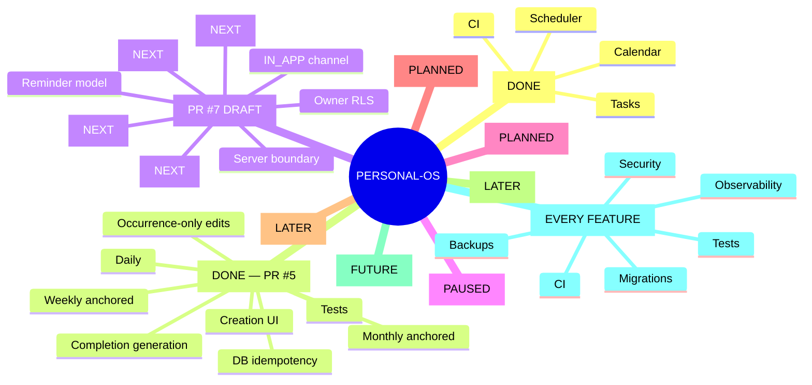

# Personal-OS — Persistent Project State

> Canonical recovery checkpoint. Read this before making project claims or changes.
> Last verified: 2026-08-30 17:10 IST.

## Current verified state

- Stable integration branch: `main`
- Current engineering branch: `feature/reminders-v1`
- Open PRs: **PR #7 (draft)**
- PR #5 — Recurring Tasks V1 — **merged** to `main` as commit `fd87fa4478f02f083d10aec71b0f5f1fc1327eaa`.
- PR #3: closed without merge; it was based on the wrong branch and must not be reused.
- PR #4: merged to `main`; clean project-state checkpoint.

## Source-of-truth hierarchy

1. Actual GitHub repository and branch contents
2. Actual Supabase schema/data contract
3. CI/test results
4. `PROJECT_STATE.md`
5. `PROJECT_ROADMAP.md`
6. Chat history/memory

If sources disagree, verify the higher-priority source. Never guess.

## Anti-confusion protocol

Before every substantial change:
1. Read roadmap and project state.
2. Verify active branch and PR state.
3. Inspect relevant code.
4. Verify live Supabase schema for DB changes.
5. Make the smallest safe change.
6. Run CI/tests/build where applicable.
7. Re-read changed files and verify the result.
8. Update this checkpoint after milestones.
9. Never report a change as verified until the authoritative system confirms it.

Branches are not PRs. A "Compare & pull request" button only means a branch has changes relative to its base.

## Merged PR history

- PR #1 — CI/build foundation — merged.
- PR #2 — Task Scheduler V1 — merged.
- PR #4 — persistent project state — merged.
- PR #5 — Recurring Tasks V1 — merged 2026-08-30 after CI #35 passed.

## Recurring Tasks V1 — COMPLETE

Implemented and merged:
- Daily, weekly and monthly recurrence rules.
- Weekly cycle anchoring.
- Monthly day 29–31 clamping with preserved anchor day.
- Recurrence validation and creation UI.
- Next-occurrence generation after completion.
- Activity events for generated occurrences.
- Guarded completion update.
- Shared TypeScript recurrence types.
- Regression tests in CI.
- Supabase partial unique index `tasks_recurring_occurrence_unique` on `(user_id, recurrence_parent_id, due_at)` for recurring occurrences.
- Application handling of PostgreSQL unique violation `23505` for concurrent generation.
- Reproducible migration committed in repository.
- V1 edit semantics: occurrence-only; series-wide editing deferred.
- Recurrence arithmetic remains UTC; timezone/DST product semantics deferred to reminder/time work.

Verification:
- CI #35 passed tests and production build on PR #5 latest head.
- PR #5 was marked ready and squash-merged successfully.
- `main` now points to merge commit `fd87fa4478f02f083d10aec71b0f5f1fc1327eaa`.
- Live Supabase idempotency index was applied and repository migration exists.

## Reminders V1 — IN PROGRESS / PR #7 DRAFT

Branch: `feature/reminders-v1`
PR: #7

Implemented so far:
- `public.reminders` table in Supabase.
- Owner-scoped RLS policies for select/insert/update/delete.
- `task_id` foreign key with cascade delete.
- `remind_at` timestamp.
- Explicit `timezone` field, default UTC.
- `channel` contract currently restricted to `IN_APP`.
- `enabled` and `delivered_at` state.
- User/task ownership validation before reminder creation.
- Upcoming-reminder query.
- Server action boundary.
- Shared reminder domain types.

Live Supabase migration `create_reminders` was successfully applied to project `gujzvkyytxsnervovvrt`.

Important design rule:
- Do not claim timezone/DST delivery is solved merely because a timezone column exists.
- Delivery worker, notification UI, idempotent delivery, and timezone semantics still require implementation and tests.

Latest PR #7 head: `2920899c7ab578e739435ea970bc447b141f6ae7`.
Fresh CI was not yet visible at the last verification; do not call PR #7 verified until CI confirms it.

## Verified Supabase state

Project: `gujzvkyytxsnervovvrt`.
- PostgreSQL 17.
- `tasks` includes recurrence fields: `recurrence_rule`, `recurrence_until`, `recurrence_parent_id`.
- RLS is enabled; authenticated owner access uses `auth.uid() = user_id`.
- `tasks_recurring_occurrence_unique` exists as the recurrence idempotency boundary.
- `reminders` now exists with owner RLS and task foreign key.
- Security advisor finding concerning `public.rls_auto_enable()` remains tracked as issue #6; do not alter it blindly.
- Foreign-key indexing/performance findings remain tracked for later hardening.

## Roadmap

1. Recurring Tasks V1 — DONE
2. Reminders V1 — CURRENT
3. Progress & Streaks V1
4. Organization V1
5. Analytics V1
6. AI Assistant V1
7. Research Agent V1
8. Adaptive Scheduling
9. Production hardening

## Cross-cutting quality gates

Every feature must address applicable security/RLS, authorization, data contracts, tests, CI/build, migration/recovery discipline, observability, backups, and project-state documentation.

## Mind tree

## Session log — 2026-08-30

- Rechecked project from scratch and established source-of-truth hierarchy.
- Confirmed PR #1/#2 merged and distinguished branches from PRs.
- Created and merged clean persistent project-state PR #4.
- Fixed weekly recurrence interval anchoring.
- Added recurrence creation UI and tests.
- Fixed monthly anchor-day drift.
- Fixed shared TypeScript monthly recurrence type.
- Applied live Supabase unique index for recurrence idempotency.
- Added reproducible recurrence migration and application handling for `23505`.
- Defined V1 recurrence editing as occurrence-only.
- CI #35 passed latest Recurring Tasks head.
- PR #5 marked ready and squash-merged.
- Created `feature/reminders-v1` from the new `main`.
- Applied the Reminders V1 Supabase migration.
- Added reminder types, server library, and server action.
- Created draft PR #7.

## Future-session rule

Never infer progress from chat wording. Verify GitHub branch/PR state, inspect relevant files, verify Supabase for data changes, verify CI, and update this checkpoint. If uncertain, mark it uncertain and continue verification rather than guessing.
