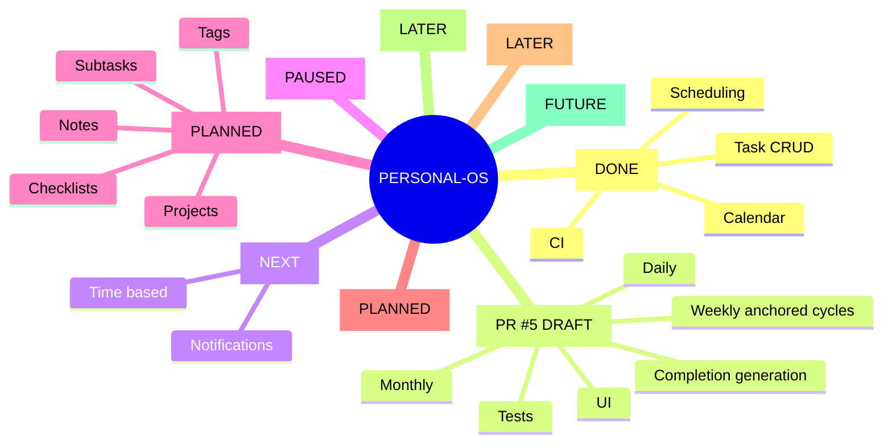

# Personal-OS — Persistent Project State

> Canonical recovery checkpoint. Read this before making project claims or changes.
> Last verified: 2026-08-30.

## Current verified state

- Stable integration branch: `main`
- Current engineering branch: `feature/recurring-tasks-v1`
- Persistent state file: `main:PROJECT_STATE.md`
- Open PRs: **PR #5 (draft)**
- PR #3: closed without merge; it was based on the wrong branch and must not be reused.
- PR #4: merged to `main`; clean project-state checkpoint.

## Source-of-truth hierarchy

1. Actual GitHub repository and branch contents
2. Actual Supabase schema/data contract
3. CI/test results
4. `PROJECT_STATE.md`
5. `PROJECT_ROADMAP.md`
6. Chat history/memory

If sources disagree, verify the higher-priority source. Never guess.

## Anti-confusion protocol

Before every substantial change:

1. Read `PROJECT_ROADMAP.md`.
2. Read `PROJECT_STATE.md`.
3. Verify the active branch and repository tree.
4. Verify the relevant live Supabase schema.
5. Inspect the existing implementation before changing it.
6. Write a short implementation plan.
7. Make small atomic commits.
8. Run tests/build/CI where applicable.
9. Update project state after each milestone.
10. Only call a feature complete after code, schema, UI, tests, and CI are verified as applicable.

Branches are not PRs. A GitHub "Compare & pull request" button means only that a branch has changes relative to its base.

## Merged PR history

- PR #1 — `ci: verify Next.js builds` — merged.
- PR #2 — `feat: task scheduler v1` — merged.
- PR #4 — `chore: persist Personal-OS project state` — merged.

## PR hygiene incident

PR #3 was accidentally created from `chore/project-state-v1`, which contained recurring-task work. It was closed without merging.

The corrective PR #4 was created from clean `main`, contained only `PROJECT_STATE.md`, passed CI, and was merged.

## Recurring Tasks V1 — IN PROGRESS / PR #5 DRAFT

Implemented on `feature/recurring-tasks-v1`:

- DAILY, WEEKLY and MONTHLY recurrence rules
- recurrence validation
- recurrence fields in the task model
- deterministic weekly-cycle anchoring using `anchorDate`
- month-end clamping for monthly day 29–31 cases
- next-occurrence generation after completion
- activity event for generated occurrences
- guarded completion update to reduce duplicate occurrence creation from concurrent completion requests
- recurrence creation UI
- recurrence tests
- CI test command

Verification status:

- CI run #25 for the current PR head passed.
- Local execution was not possible in this environment because outbound GitHub/network access is unavailable; CI is therefore the execution authority.

Still required before Recurring Tasks V1 can be marked complete:

- Verify the live Supabase schema/RLS/constraints again.
- Review the concurrency guard against actual database behavior.
- Define/implement clear series-editing semantics, or explicitly defer them from V1.
- Define timezone/DST semantics before reminders.
- Review UI/error states.
- Inspect PR #5 diff for accidental unrelated changes.
- Mark PR ready only after the remaining review is complete.
- Merge only after all applicable verification passes.

## Important recurrence semantics

- DAILY: interval means number of days.
- WEEKLY: interval means number of calendar weeks between recurrence cycles; selected weekdays within an active cycle are generated in order. `anchorDate` identifies the cycle anchor.
- MONTHLY: interval means number of calendar months; day 29–31 clamps to the last valid day of the target month.
- Current implementation performs recurrence arithmetic in UTC. User timezone/DST behavior is not yet a product contract.

## Verified Supabase schema — 2026-08-30

Project is active/healthy on PostgreSQL 17.

`tasks` currently contains:
- id, user_id, project_id, parent_task_id
- title, description, status, priority
- due_at, scheduled_start, scheduled_end
- estimated_minutes, actual_minutes, completed_at
- created_at, updated_at
- recurrence_rule, recurrence_until, recurrence_parent_id

`activity_events` currently contains:
- id, user_id, event_type, entity_type, entity_id
- occurred_at, metadata, created_at

Security advisor follow-up:
- Supabase reports `public.rls_auto_enable()` is SECURITY DEFINER and executable by both `anon` and `authenticated` through RPC.
- Tracked as GitHub issue #6; inspect intended use before changing privileges.

Performance advisor follow-up:
- `tasks.parent_task_id`, `tasks.project_id`, and `projects.goal_id` foreign keys lack covering indexes.
- Several indexes are currently reported unused; do not remove them solely from this snapshot without workload evidence.

Do not invent columns or tables without re-checking the live schema.

## Roadmap

1. Recurring Tasks V1 — current
2. Reminders V1
3. Progress & Streaks V1
4. Organization V1
5. Analytics V1
6. AI Assistant V1
7. Research Agent V1
8. Adaptive Scheduling
9. Production hardening

## Mind tree

## Session log — 2026-08-30

- Rechecked project from scratch after uncertainty about PR state.
- Confirmed PR #1 and #2 are merged; no old PRs were pending.
- Verified the screenshot distinction: two branches had Compare & pull request buttons, not two open PRs.
- Created persistent project-state documentation.
- Detected that the first project-state branch was based on the recurring feature; closed contaminated PR #3.
- Created clean project-state PR #4 from `main`; CI passed; merged it.
- Fixed weekly recurrence interval semantics with a stable `anchorDate`.
- Added recurrence creation UI.
- Added a concurrency guard against duplicate completion-generated occurrences.
- Added recurrence tests and wired them into CI.
- Created draft PR #5 for Recurring Tasks V1.
- CI run #25 passed for PR #5 head.
- Supabase security/performance advisors were checked; security issue #6 was recorded for follow-up.

## Future-session rule

Never infer progress from chat wording such as "done", "pending PR", or "we already built it". Verify GitHub branch/PR state, inspect the relevant files, verify Supabase when data contracts are involved, and then update this checkpoint. If uncertain, mark it uncertain and verify it before acting.
