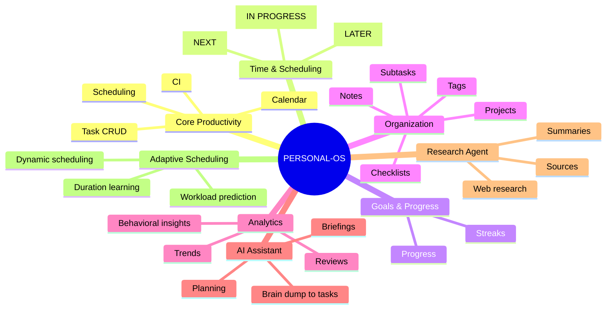

# Personal-OS — Persistent Project State

> Canonical recovery checkpoint. Read this before making project claims or changes.
> Last verified: 2026-08-30.

## Current verified state

- Stable integration branch: `main`
- Current feature branch: `feature/recurring-tasks-v1`
- Project-state branch: `chore/project-state-clean-v1`
- Open PRs before this checkpoint: PR #3 was a candidate created from the wrong base and must not be merged.
- Merged PRs: #1 CI, #2 Scheduler.

## Source-of-truth hierarchy

1. Actual GitHub repository and branch contents
2. Actual Supabase schema/data contract
3. CI/test results
4. `PROJECT_STATE.md`
5. `PROJECT_ROADMAP.md`
6. Chat history/memory

If sources disagree, verify the higher-priority source. Never guess.

## Anti-confusion protocol

Before every substantial change:

1. Read `PROJECT_ROADMAP.md`.
2. Read `PROJECT_STATE.md`.
3. Verify the active branch and repository tree.
4. Verify the relevant live Supabase schema.
5. Inspect the existing implementation before changing it.
6. Write a short implementation plan.
7. Make small atomic commits.
8. Run tests/build/CI where applicable.
9. Update project state after each milestone.
10. Only call a feature complete after code, schema, UI, tests, and CI are verified as applicable.

Branches are not PRs. A GitHub "Compare & pull request" button means only that a branch has changes relative to its base.

## Merged PR history

- PR #1 — `ci: verify Next.js builds` — merged to `main`.
- PR #2 — `feat: task scheduler v1` — merged to `main`.

## PR hygiene incident

PR #3 (`chore: persist Personal-OS project state`) was created from `chore/project-state-v1`, which was based on recurring-task work rather than clean `main`. Its diff therefore contained feature implementation as well as state documentation. It must NOT be merged as a documentation-only PR.

Corrective action: create a clean project-state branch directly from `main`, copy only `PROJECT_STATE.md`, and close PR #3. The recurring implementation remains isolated on `feature/recurring-tasks-v1`.

## Feature status

### Completed

- Core task CRUD/workflow
- Task status, priority, duration
- Due date/time
- Scheduled start/end
- Day / Week / Month calendar
- CI build verification
- Scheduler/calendar merged to `main`

### Recurring Tasks V1 — IN PROGRESS

Existing implementation includes:

- `RecurrenceRule` with DAILY, WEEKLY and MONTHLY forms
- recurrence validation
- recurrence fields on tasks
- next-occurrence generation after completion
- recurrence activity event

Known correctness work before completion:

- Weekly interval > 1 must be anchored to the recurrence cycle, not merely searched for a matching weekday.
- Add deterministic recurrence tests, including month-end behavior.
- Prevent duplicate next-occurrence creation under concurrent completion requests.
- Define series editing semantics: this occurrence vs entire series.
- Define timezone/DST semantics before reminders.
- Verify RLS/constraints against the live schema.
- Review UI and error states.
- Run CI/build and inspect results.

### Next execution order

1. Finish and merge clean project-state checkpoint.
2. Fix recurrence semantics.
3. Add recurrence tests.
4. Verify database/RLS/constraints.
5. Review recurring-task UI.
6. Run CI/build.
7. Create recurring-task PR.
8. Review and merge only after verification.
9. Begin Reminders V1.

## Verified Supabase schema — 2026-08-30

Project is active/healthy on PostgreSQL 17.

`tasks` currently contains:
- id, user_id, project_id, parent_task_id
- title, description, status, priority
- due_at, scheduled_start, scheduled_end
- estimated_minutes, actual_minutes, completed_at
- created_at, updated_at
- recurrence_rule, recurrence_until, recurrence_parent_id

`activity_events` currently contains:
- id, user_id, event_type, entity_type, entity_id
- occurred_at, metadata, created_at

Do not invent columns or tables without re-checking the live schema.

## Roadmap

1. Recurring Tasks V1
2. Reminders V1
3. Progress & Streaks V1
4. Organization V1
5. Analytics V1
6. AI Assistant V1
7. Research Agent V1
8. Adaptive Scheduling
9. Production hardening

## Mind tree

## Session log — 2026-08-30

- Rechecked project from scratch after uncertainty about PR state.
- Confirmed PR #1 and PR #2 are merged.
- Confirmed branch candidates are not automatically open PRs.
- Verified recurring implementation and live Supabase schema.
- Found weekly recurrence interval correctness issue.
- Generated a visual mind-tree checkpoint.
- Created a persistent state file.
- Discovered that the first state branch was based on the recurring feature branch, so PR #3 is contaminated with feature changes.
- Corrective clean branch is now based directly on `main`.

## Rule for future sessions

Do not infer project progress from conversational claims. Start by reading this file and the roadmap, then verify GitHub and Supabase. Record every major milestone here. If something is uncertain, explicitly mark it uncertain and verify it before acting.
