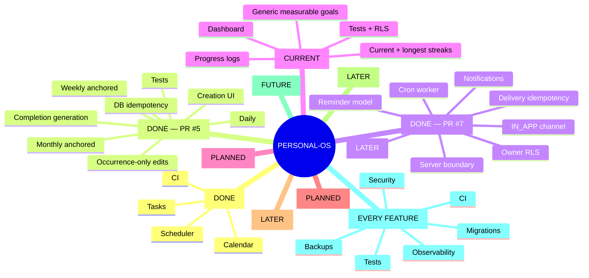

# Personal-OS — Persistent Project State

> Canonical recovery checkpoint. Read this before making project claims or changes.
> Last verified: 2026-09-05.

## Current verified state

- Stable integration branch: `main`
- Current engineering branch: `feature/progress-streaks-v1`
- PR #5 — Recurring Tasks V1 — **merged** to `main`.
- PR #7 — Reminders V1 — **merged** to `main` as commit `f12259978670a516dd6f9dda5704715dad7cd4fcc`.
- `feature/progress-streaks-v1` is the active engineering branch and PR #8 is open for Progress & Streaks V1.
- The branch includes goals/progress schema, RLS policies, dashboard UI, progress actions, batched loading, streak calculations, and tests.
- Progress goal and entry inserts now include the authenticated `user_id`, matching the RLS contract.
- The progress test suite now uses the repository’s configured `tsx --test` runner.
- PR #3: closed without merge; wrong branch, do not reuse.
- PR #4: merged; persistent project-state checkpoint.

## Source-of-truth hierarchy

1. Actual GitHub repository and branch contents
2. Actual Supabase schema/data contract
3. CI/test results
4. `PROJECT_STATE.md`
5. `PROJECT_ROADMAP.md`
6. Chat history/memory

If sources disagree, verify the higher-priority source. Never guess.

## Anti-confusion protocol

Before every substantial change:
1. Read roadmap and project state.
2. Verify active branch and PR state.
3. Inspect relevant code.
4. Verify live Supabase schema for DB changes.
5. Make the smallest safe change.
6. Run CI/tests/build where applicable.
7. Re-read changed files and verify the result.
8. Update this checkpoint after milestones.
9. Never report a change as verified until the authoritative system confirms it.

Branches are not PRs. A Compare & pull request button only means a branch has changes relative to its base.

## Merged PR history

- PR #1 — CI/build foundation — merged.
- PR #2 — Task Scheduler V1 — merged.
- PR #4 — persistent project state — merged.
- PR #5 — Recurring Tasks V1 — merged.
- PR #7 — Reminders V1 — merged after CI #52 passed.

## Recurring Tasks V1 — COMPLETE

Implemented and merged:
- Daily, weekly and monthly recurrence rules.
- Weekly cycle anchoring.
- Monthly day 29–31 clamping with preserved anchor day.
- Recurrence validation and creation UI.
- Next-occurrence generation after completion.
- Activity events for generated occurrences.
- Guarded completion update.
- Shared TypeScript recurrence types.
- Regression tests in CI.
- Supabase partial unique index for recurring occurrence idempotency.
- Application handling of PostgreSQL unique violation `23505`.
- Reproducible migration committed in repository.
- V1 edit semantics: occurrence-only; series-wide editing deferred.
- Recurrence arithmetic remains UTC; timezone/DST product semantics deferred to reminder/time work.

## Reminders V1 — COMPLETE

Merged to `main` as PR #7.

Implemented:
- `public.reminders` with owner-scoped RLS.
- Task ownership validation.
- Scheduled timestamp and explicit timezone field.
- `IN_APP` channel contract.
- Enabled/delivered state.
- Upcoming-reminder query.
- Server action boundary.
- Authenticated cron delivery endpoint.
- Durable `notifications` table with unique `reminder_id`.
- Notification RLS.
- Reminder delivery activity events.
- Dashboard scheduling UI and upcoming-reminders UI.
- Reminder validation tests.
- Cron configuration.
- CI verification.

Important limitation:
- A timezone column exists, but full user-local timezone/DST scheduling semantics remain a future hardening item. Do not claim arbitrary timezone/DST behavior is solved.

## Progress & Streaks V1 — CURRENT / PR #8

Verified on the active branch:
- Generic measurable goals with positive targets.
- Positive progress entries with date validation.
- Current and longest streak calculations, with duplicate entries on one day treated as one streak day.
- Dashboard goal cards, progress logging form, percentage summary, and streak display.
- Goals and progress entries migration with owner-scoped RLS and positive-value constraints.
- Progress unit tests pass under `npm run test`.

Important implementation note:
- Goal and progress inserts must include the authenticated user ID; the branch now enforces this at the service boundary and passes it from authenticated server actions.

Current verification blocker:
- `npm run test` passes all 13 tests.
- `npm run build` compiles TypeScript but currently fails during Next.js prerendering with a global-error `useContext` failure in the local CI-style environment. Do not mark PR #8 merge-ready until CI/build is green.

## Verified Supabase state

Project: `gujzvkyytxsnervovvrt`.
- PostgreSQL 17.
- `tasks` includes recurrence fields.
- RLS is enabled; authenticated owner access uses `auth.uid() = user_id`.
- Recurrence idempotency index exists.
- `reminders` exists with owner RLS and task foreign key.
- `notifications` exists with unique `reminder_id` and owner RLS.
- Security advisor finding concerning `public.rls_auto_enable()` remains tracked as issue #6; do not alter it blindly.
- Foreign-key indexing/performance findings remain tracked for later hardening.

## Roadmap

1. Recurring Tasks V1 — DONE
2. Reminders V1 — DONE
3. Progress & Streaks V1 — CURRENT
4. Organization V1
5. Analytics V1
6. AI Assistant V1
7. Research Agent V1
8. Adaptive Scheduling
9. Production hardening

## Cross-cutting quality gates

Every feature must address applicable security/RLS, authorization, data contracts, tests, CI/build, migration/recovery discipline, observability, backups, and project-state documentation.

## Mind tree

## Session log — 2026-08-30

- Rechecked project from scratch and established source-of-truth hierarchy.
- Created and merged persistent project-state PR #4.
- Completed Recurring Tasks V1 and merged PR #5.
- Completed Reminders V1 and merged PR #7.
- Verified Reminders CI #52 passed tests and production build.
- Started Progress & Streaks from the existing feature branch instead of rebuilding its generic streak engine.
- Confirmed `calculateStreak` and `progressPercent` groundwork exists on `feature/progress-streaks-v1`.
- Corrected this checkpoint so roadmap status matches actual merged PR state.

## Future-session rule

Never infer progress from chat wording. Verify GitHub branch/PR state, inspect relevant files, verify Supabase for data changes, verify CI, and update this checkpoint. If uncertain, mark it uncertain and continue verification rather than guessing.
