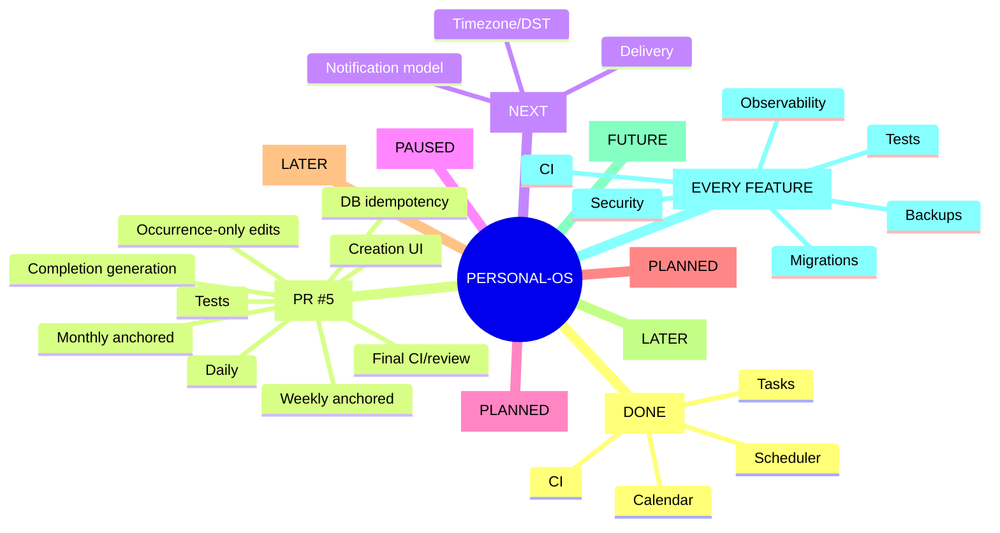

# Personal-OS — Persistent Project State

> Canonical recovery checkpoint. Read this before making project claims or changes.
> Last verified: 2026-08-30 16:10 IST.

## Current verified state

- Stable integration branch: `main`
- Current engineering branch: `feature/recurring-tasks-v1`
- Persistent state file: `main:PROJECT_STATE.md`
- Open PRs: **PR #5 (draft)**
- PR #3: closed without merge; it was based on the wrong branch and must not be reused.
- PR #4: merged to `main`; clean project-state checkpoint.
- Latest recurring-task branch commits include monthly anchor preservation, shared type correction, and database-idempotency handling.

## Source-of-truth hierarchy

1. Actual GitHub repository and branch contents
2. Actual Supabase schema/data contract
3. CI/test results
4. `PROJECT_STATE.md`
5. `PROJECT_ROADMAP.md`
6. Chat history/memory

If sources disagree, verify the higher-priority source. Never guess.

## Anti-confusion protocol

Before every substantial change:
1. Read roadmap and project state.
2. Verify active branch and PR state.
3. Inspect relevant code.
4. Verify live Supabase schema for DB changes.
5. Make the smallest safe change.
6. Run CI/tests/build where applicable.
7. Re-read the changed files and verify the result.
8. Update this checkpoint after milestones.
9. Never report a change as verified until the authoritative system confirms it.

Branches are not PRs. A "Compare & pull request" button only means a branch has changes relative to its base.

## Merged PR history

- PR #1 — CI/build foundation — merged.
- PR #2 — Task Scheduler V1 — merged.
- PR #4 — persistent project state — merged.

## Recurring Tasks V1 — IN PROGRESS / PR #5 DRAFT

Implemented:
- Daily, weekly and monthly recurrence rules.
- Weekly cycle anchoring.
- Monthly day 29–31 clamping with preserved anchor day.
- Recurrence validation and creation UI.
- Next-occurrence generation after completion.
- Activity events for generated occurrences.
- Guarded completion update.
- Shared TypeScript recurrence types.
- Regression tests in CI.

Database correctness:
- A Supabase partial unique index named `tasks_recurring_occurrence_unique` has now been applied to `(user_id, recurrence_parent_id, due_at)` for recurring occurrences.
- Application code handles PostgreSQL unique-violation `23505` by reusing the existing occurrence.
- A matching migration file has been added to `feature/recurring-tasks-v1` so the database change is reproducible.

Series editing decision:
- V1 edits are **occurrence-only**. The current edit UI does not expose recurrence-rule editing, preventing accidental mutation of the entire series.
- Series-wide editing is deferred until a dedicated UX/API contract exists.

Timezone decision:
- Recurrence arithmetic remains UTC in V1.
- User timezone/DST behavior is intentionally deferred to the Reminders/time semantics work; do not pretend local-time recurrence is solved.

Verification:
- CI run #33 passed tests and production build for the earlier corrected head.
- The database uniqueness migration has been applied successfully to live Supabase.
- A fresh CI run is still required for the latest idempotency/migration commits before PR #5 can be merged.

Remaining before merge:
1. Fresh CI green on latest head.
2. Inspect final PR diff for unrelated changes.
3. Review UI/error states.
4. Confirm migration is represented in repository history.
5. Mark PR ready and merge only after all applicable checks pass.

## Verified Supabase state

Project: `gujzvkyytxsnervovvrt`.
- PostgreSQL 17.
- `tasks` includes recurrence fields: `recurrence_rule`, `recurrence_until`, `recurrence_parent_id`.
- RLS is enabled; authenticated owner access uses `auth.uid() = user_id`.
- `tasks_recurring_occurrence_unique` now exists as the database idempotency boundary.
- Security advisor finding concerning `public.rls_auto_enable()` remains tracked as issue #6; do not alter it blindly.
- Foreign-key indexing/performance findings remain tracked for later hardening.

## Roadmap

1. Recurring Tasks V1 — current
2. Reminders V1
3. Progress & Streaks V1
4. Organization V1
5. Analytics V1
6. AI Assistant V1
7. Research Agent V1
8. Adaptive Scheduling
9. Production hardening

## Cross-cutting quality gates

Every feature must address applicable security/RLS, authorization, data contracts, tests, CI/build, migration/recovery discipline, observability, backups, and project-state documentation.

## Mind tree

## Session log — 2026-08-30

- Rechecked project from scratch and established source-of-truth hierarchy.
- Confirmed PR #1/#2 merged and distinguished branches from PRs.
- Created and merged clean persistent project-state PR #4.
- Fixed weekly recurrence interval anchoring.
- Added recurrence creation UI and tests.
- Fixed monthly anchor-day drift.
- Fixed shared TypeScript monthly recurrence type.
- Verified CI #33 green on corrected head.
- Applied live Supabase unique index for recurring-occurrence idempotency.
- Added reproducible migration file to recurring branch.
- Updated application logic to treat database unique violation as an idempotent concurrent winner/loser path.
- Defined V1 recurrence editing as occurrence-only.
- Latest remaining gate is fresh CI on the newest branch head, then final PR review/merge.

## Future-session rule

Never infer progress from chat wording. Verify GitHub branch/PR state, inspect relevant files, verify Supabase for data changes, verify CI, and update this checkpoint. If uncertain, mark it uncertain and continue verification rather than guessing.
