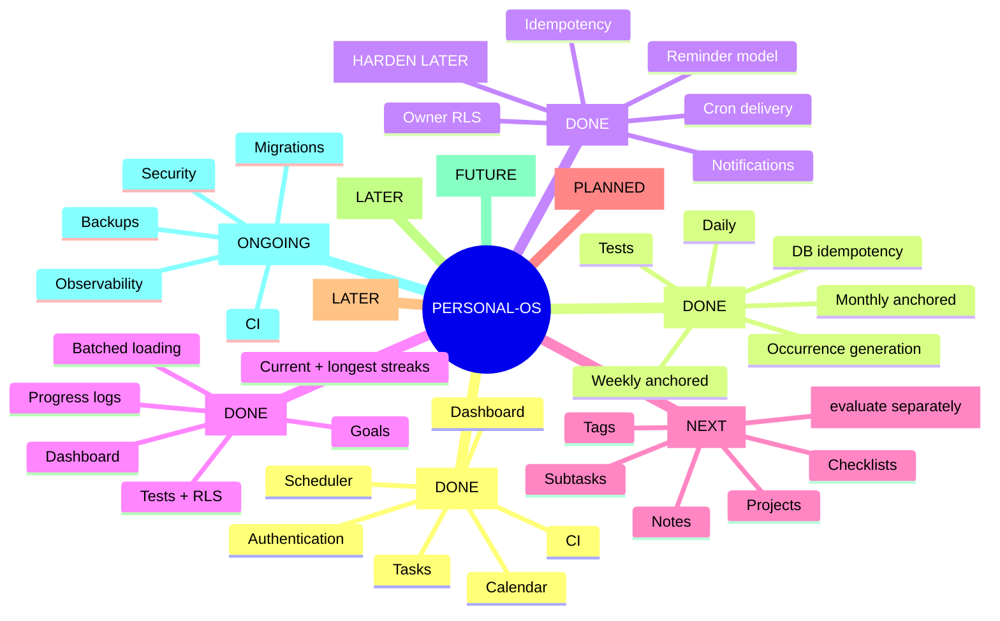

# Personal-OS — Persistent Project State

> Canonical recovery checkpoint. Read this before making project claims or changes.
> Last verified: 2026-09-05.

## Current verified state

- Stable integration branch: `main`
- Current `main` commit: `b25e4250816a785e9e4dbc5bf124d72d34b9a476` (`fix: restrict rls_auto_enable client execution`).
- Recurring Tasks V1 — **merged** (PR #5).
- Reminders V1 — **merged** (PR #7).
- Progress & Streaks V1 — **merged** (PR #8).
- Security issue #6 — **closed/completed** after client execution was revoked for `public.rls_auto_enable()` and security verification reported 0 lints.
- Open GitHub issue backlog — **0** at last verification.
- Latest verified CI on `main` — **successful**; tests and production build passed.
- No feature branch is currently required for the completed Progress & Streaks milestone.

## Source-of-truth hierarchy

1. Actual GitHub repository and branch contents
2. Actual Supabase schema/data contract
3. CI/test results
4. `PROJECT_STATE.md`
5. `PROJECT_ROADMAP.md`
6. Chat history/memory

If sources disagree, verify the higher-priority source. Never guess.

## Anti-confusion protocol

Before every substantial change:
1. Read roadmap and project state.
2. Verify active branch and PR state.
3. Inspect relevant code.
4. Verify live Supabase schema for DB changes.
5. Make the smallest safe change.
6. Run CI/tests/build where applicable.
7. Re-read changed files and verify the result.
8. Update this checkpoint after milestones.
9. Never report a change as verified until the authoritative system confirms it.

Branches are not PRs. A Compare & pull request button only means a branch has changes relative to its base.

## Completed milestones

### Recurring Tasks V1 — COMPLETE
- Daily, weekly and monthly recurrence rules.
- Weekly cycle anchoring.
- Monthly day 29–31 clamping with preserved anchor day.
- Recurrence validation and creation UI.
- Next-occurrence generation after completion.
- Activity events and guarded completion updates.
- Shared recurrence types and regression tests.
- Supabase partial unique index for recurring occurrence idempotency.
- PostgreSQL `23505` handling.
- Reproducible migration.
- V1 occurrence-only editing semantics.
- Full timezone/DST recurrence semantics remain deferred.

### Reminders V1 — COMPLETE
- Owner-scoped reminders and notifications with RLS.
- Task ownership validation.
- Scheduled timestamp + timezone field.
- `IN_APP` channel.
- Upcoming-reminder query and server action boundary.
- Authenticated cron delivery endpoint.
- Durable notification records and delivery idempotency.
- Activity events, dashboard scheduling/upcoming UI.
- Validation tests, cron configuration and CI verification.
- Full user-local timezone/DST semantics remain a hardening item.

### Progress & Streaks V1 — COMPLETE
- Generic measurable goals with positive targets.
- Positive progress entries with date validation.
- Current and longest streak calculations; duplicate entries on one day count once.
- Dashboard goal cards, progress logging, percentage and streak display.
- Goals/progress migration with owner-scoped RLS and positive-value constraints.
- Batched dashboard loading to avoid N+1 progress queries.
- Authenticated `user_id` enforced at the service boundary.
- Progress unit tests included in the repository test command.
- PR #8 merged to `main`.

## Security / hardening status

- `public.rls_auto_enable()` client execution restricted; security issue #6 closed.
- Security verification reported 0 advisor lints after remediation.
- Foreign-key indexing/performance findings should still be reviewed during production hardening.
- CI/build must remain a merge gate for future work.

## Roadmap

1. Recurring Tasks V1 — DONE
2. Reminders V1 — DONE
3. Progress & Streaks V1 — DONE
4. **Organization V1 — NEXT**
5. Analytics V1
6. AI Assistant V1
7. Research Agent V1
8. Adaptive Scheduling
9. Production hardening

## Mind tree

## Definition of done — every feature

A feature is not complete merely because the UI works. Where applicable, verify:
1. Data model/schema
2. Authorization/RLS
3. Backend/application logic
4. Edge cases and failure states
5. Unit/integration/regression tests
6. UI/UX
7. CI/build
8. Migration/recovery implications
9. Documentation + `PROJECT_STATE.md`

## Future-session rule

Never infer progress from chat wording. Verify GitHub branch/PR state, inspect relevant files, verify Supabase for data changes, verify CI, and update this checkpoint. If uncertain, mark it uncertain and continue verification rather than guessing.
